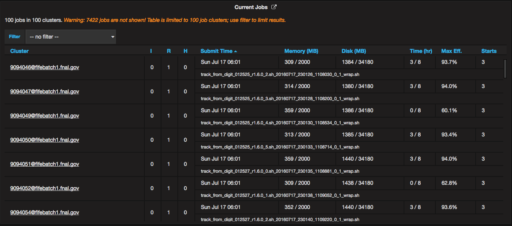
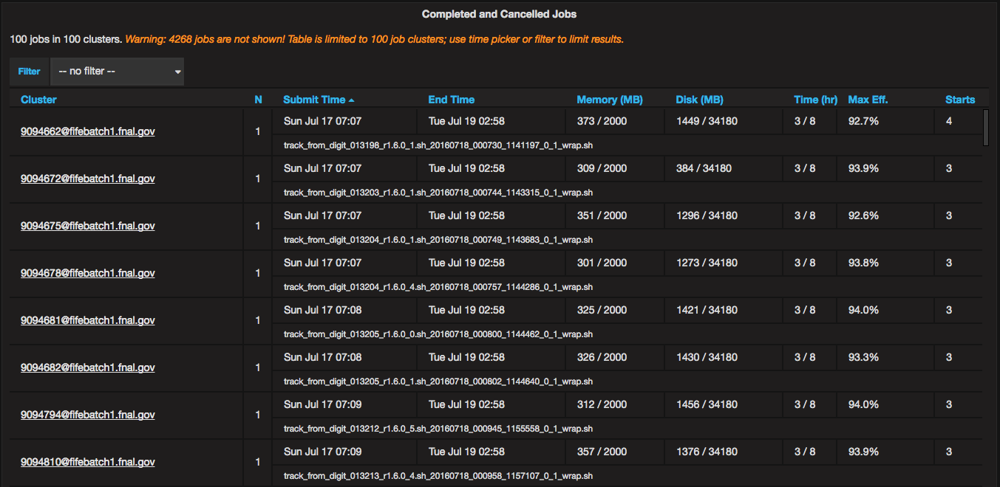
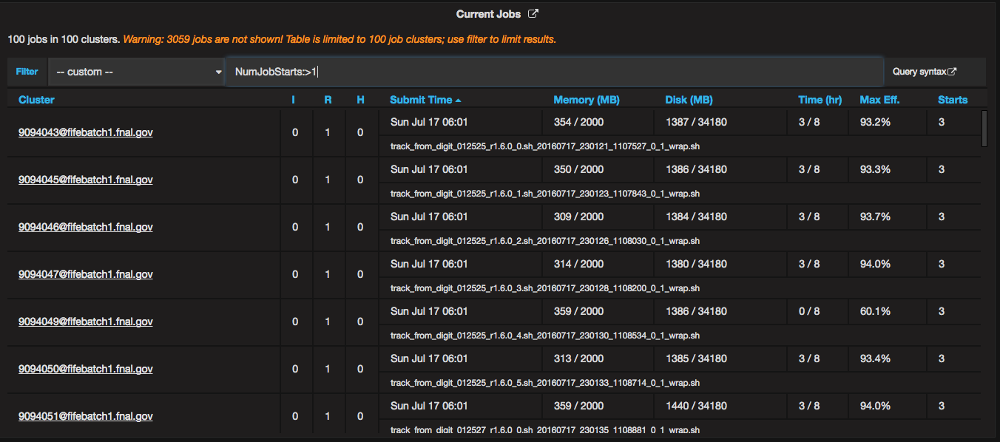
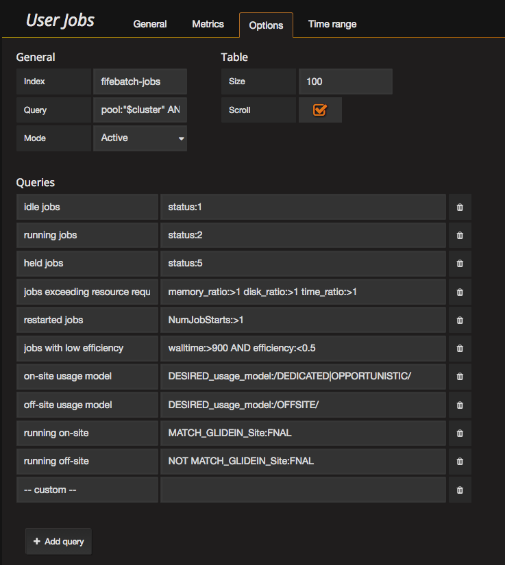

# userjobs

Display aggregate summaries of documents from an Elasticsearch table. 
Columns and aggregations are currently hardcoded and specific for Fifemon.

# screenshots

# Changelog

## 0.3.1

* Update for Grafana 4.5 (change rangeRaw to range.raw)
* Add configurable background colors

## 0.3.0

* Group DAGman jobs

## 0.2.1

* Fix time display to 24-hour and add timezone offset

## 0.2.0

* Set `lowercase_expanded_terms: false` in query since we are querying against `not_analyzed` fields.
* Fixed README and icons
* Add screenshots
